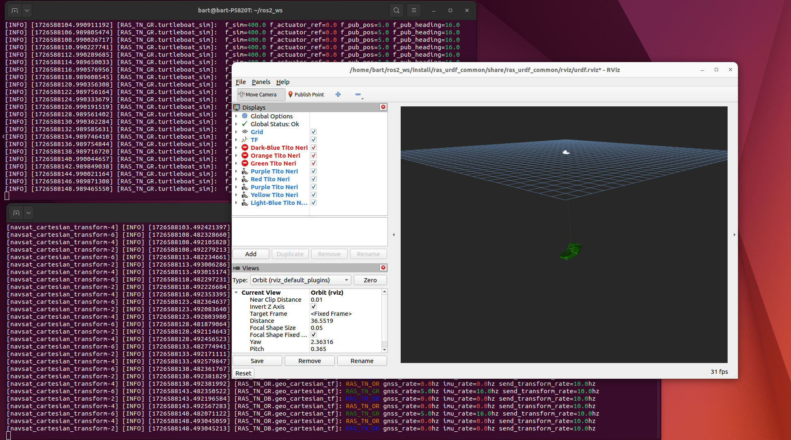

# User guide: 3) Visualise a ship using RViz

**Goal:** See what a ship is doing in our ros environment

**Prerequisites:** ROS2 installed. Rviz2 installed (comes by default with desktop-ros installations). Have a RAS vessel simulator running within the system with the namespace of a known RAS ship (e.g. start turtleboat with arguments `--ros-args -r __ns:=/RAS_TN_GR`)

## Preparation
We need two packages to be placed in the ros2_ws. 
1) [urdf_launch](https://github.com/ros/urdf_launch) which is a library that we use. Copy manually into the source folder or use git. 

2) [ras_urdf_common](https://github.com/RAS-Delft/ras_urdf_common) which has an urdf file for the tito neri and Rviz2 configurations that we will use. 

Build and source your ros2 workspace. 

## Starting Rviz with RAS configurations
open a terminal and launch the 'rviz_bringup.launch.py' file from the ras_urdf_common package. This launchfile starts up several nodes, including an rviz2 instance that should display our virtual ship if the data is published on the correct topics.

```shell
ros2 launch ras_urdf_common rviz_bringup.launch.py 
```

However, Rviz expects the state of the ship to be published on the /tf topic in local cartesian coordinates. Our ship outputs its location in latitude/longitude as a gnss would. 

## Starting global to local transformation nodes
We need pyproj and Xacro installed for this.

Pip:
```shell
pip install pyproj
```

Xacro:
```shell
sudo apt-get update; sudo apt install ros-${ROS_DISTRO}-xacro
```

Clone the [ras_ros_core_control_modules](https://github.com/RAS-Delft/ras_ros_core_control_modules) rospackage in your rosworkspace
``` shell
cd ~/ros2_ws/src
git clone https://github.com/RAS-Delft/ras_ros_core_control_modules
```

Build and source your workspace. 

Start the fleet_geo_utils.launch.py from the ras_ros_core_control_modules package. This launchfile brings up various services such as geographical to local transformation and broadcasting of ship URDF definition. 
```shell
ros2 launch ras_ros_core_control_modules fleet_geo_utils.launch.py
```



## Further options:
- Consider running the simulator and the observer on different devices, to see whether your network setup that you did earlier on went allright. 
- You can also add more ship simulators (with different namespaces!).
- Take a look at various topics/nodes that appeared.
- look through the mentioned launch files and see how they are structured, what nodes they are starting, and parameters given to the nodes. 
